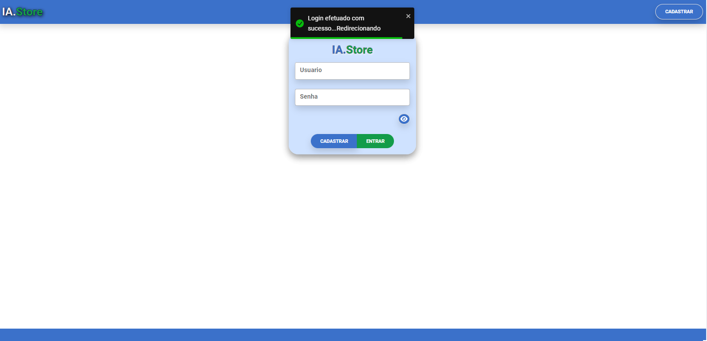

## USA-EN
# Welcome to my project 
A web application crafted using an array of technologies and tools. This repository serves as a comprehensive resource, housing both the source code and documentation essential for gaining insight into the intricacies of the project.

# **Project Overview**

The application revolves around managing a product inventory, featuring a streamlined cart for quick pickups. It integrates with the Mercado Livre BR API

___

# **Key Technologies Utilized**
The table below highlights the main technologies used in the project, both on the front-end and back-end.

| **Front** | **Back**|
| ------ | ------ |
| Mercado Livre Application Programming Interface (API) | JWT - JavaScript Object Notation (JSON) Web Token|
| React - UseContext / UseState / UseRef / UseEffect | Sequelize - Object-Relational Mapping (ORM)  |
| Axios - Promise Based HTTP client | Seeders - Initial Population Database |
| React Bootstrap - User Interface Kit | MVC Architecture Pattern |
| MDB - React User Interface Kit | Bcrypt - Hash Encryption |
| React - Tostify and Tooltips| Database Migrations |
| Accessibility (Dark Theme) | Controllers  |
| React Font Awesome Icons | Express |
| Eslint - Linter | Routes |
| Input Masks | Node |

___

# **Getting Started**

**1- Clone the repository using:**
```sh
git clone https://github.com/leoo1992/Almoxarifado.git
```
**2- Access and Install Dependencies in Front-end and Back-end using:** 
```sh
npm install.
```
**3- Configure environment variables (.env) in back-end. Example:**
```sh
DB_HOST=localhost
DB_PORT=3306
DB_USER=root
DB_PASSWORD=root
DB_DATABASE=project
JWT_SECRET= your JWT Key
DB_DIALECT=mysql
```

**4- Install and configure your MySQL:**

**5- Run the application with:**
```sh
cd .\back-end\
npm start
```

**6- Wait for the back-end to initialize, then start the front-end with:**
```sh
cd .\front-end\
npm start
```

## PT-BR
# Bem-vindo ao meu projeto 
Uma aplicação web desenvolvida utilizando uma variedade de tecnologias e ferramentas. Este repositório serve como um recurso abrangente, abrigando tanto o código-fonte quanto a documentação essencial para obter insights sobre as complexidades do projeto.

# **Visão Geral do Projeto**

A aplicação gira em torno da gestão de um inventário de produtos, apresentando um carrinho simplificado para retiradas rápidas. Ela se integra com a API do Mercado Livre BR.

___

# **Principais Tecnologias Utilizadas**
A tabela abaixo destaca as principais tecnologias utilizadas no projeto, tanto no front-end quanto no back-end.

| **Front** | **Back**|
| ------ | ------ |
| Interface de Programação de Aplicações (API) do Mercado Livre | JWT - JWT - Token da Web de Notação de Objetos JavaScript (JSON)|
| React - UseContext / UseState / UseRef / UseEffect | Sequelize - Mapeamento Objeto-Relacional (ORM)  |
| Axios - Cliente HTTP baseado em Promessas | Seeders - População Inicial do Banco de Dados |
| React Bootstrap - Kit de Interface de Usuário | Padrão de Arquitetura MVC |
| MDB - Kit de Interface de Usuário React | Bcrypt - Criptografia de Hash |
| React - Tostify e Tooltips| Migrações de Banco de Dados |
| Acessibilidade (Tema Escuro) | Controladores  |
| Ícones Font Awesome do React | Express |
| Eslint - Verificador de Erros de Sintaxe| Rotas |
| Máscaras de Entrada | Node |

___

# **Primeiros Passos**

**1-  Faça um clone o repositório usando:**
```sh
git clone https://github.com/leoo1992/Almoxarifado.git
```
**2- Acesse e instale as dependências no front-end e no back-end usando:** 
```sh
npm install.
```
**3- Configure as variáveis de ambiente (.env) no back-end. Exemplo:**
```sh
DB_HOST=localhost
DB_PORT=3306
DB_USER=root
DB_PASSWORD=root
DB_DATABASE=project
JWT_SECRET= your JWT Key
DB_DIALECT=mysql
```
**4- Execute a aplicação com:**
```sh
cd .\back-end\
npm start
```

**5- Aguarde o back-end inicializar e, em seguida, inicie o front-end com:**
```sh
cd .\front-end\
npm start
```

# Project Images / imagens do projeto:

## Login




## Register / Cadastro


## App


## Search and add in cart / Procurar e adicionar ao Carrinho 


## Finalizing the purchase purchase / Finalizarndo a compra


## Tablet


## Mobile

